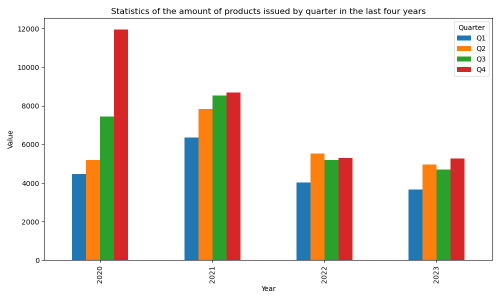

# `Statistics of the amount of products issued by quarter in the last four years `Data Crawler and Visualizer

## Project Overview

This project is designed to crawl and process data from the specified URL (`https://v1.cn-abs.com/`) and  API endpoint.  It fetches data representing the "Product issuance amount statistics in the last two years," processes it into a structured format, and then visualizes the monthly trends for each year in a line plot.

## Getting Started

### Prerequisites

- Python 3.x
- Libraries: requests, json, pandas, matplotlib

### Installation

1. Ensure Python and pip are installed.

2. Install the required packages:

   ```bash
   pip install requests pandas matplotlib
   ```


### Files

- `data_process.py`: The main Python script that includes functions for fetching, parsing, saving, and visualizing data.
- `data/`: Directory where output CSV files are saved (if applicable).
- `README.md`: This file, containing documentation for the project.

## Usage

To run the script, execute the following command:

```bash
python data_process.py
```

### Functions

- `fetch_data(url, headers, data)`: Fetches data from the API using a POST request.
- `main(data)`: Main function to initiate data fetching and processing.
- `data_parse(data)`: Parses the raw data into a structured format.
- `data2df(data)`: Converts the list of dictionaries into a transposed DataFrame.
- `save_to_csv(df, fileName)`: Saves the DataFrame to a CSV file.
- `visualization(df)`: Visualizes the data in a line plot.

## Visualization

The script generates a line plot visualizing the product issuance amount statistics for the last two years. Below is an example of the visual output:




## Contributing

Contributions to this project are welcome. Please fork the repository and submit a pull request with your features or fixes.

